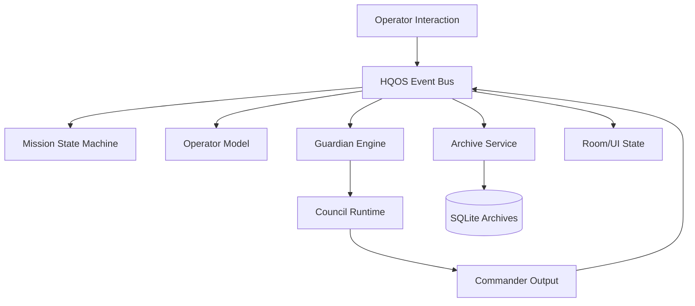

# HQOS Event Bus Architecture v0.2

## Purpose
The event bus is the nervous system of Headquarters. It connects rooms, services, departments, AI modules, state machines, and archives without hard coupling them.

## Rules
- Services publish events; they do not directly mutate unrelated services.
- State machines subscribe to approved event families.
- AI departments consume events and produce recommendations, not direct UI mutations.
- UI components render state; they do not become the source of truth.
- Every high-impact event is persisted.

## Core Event Flow


## Priority Handling
1. Black: emergency interrupts
2. Red: Guardian/Sentinel intervention
3. Amber: attention-level state updates
4. Green: healthy confirmations
5. White: routine archive/service updates

## Implementation Notes
Recommended package: `packages/hqos`.

Suggested interfaces:
```ts
type HqEvent<TPayload = unknown> = {
  id: string;
  type: string;
  source: string;
  severity: 'white' | 'green' | 'amber' | 'red' | 'black';
  missionId?: string;
  timestamp: string;
  payload: TPayload;
};
```

```ts
interface EventBus {
  publish(event: HqEvent): Promise<void>;
  subscribe(type: string, handler: (event: HqEvent) => Promise<void>): () => void;
}
```

## Acceptance Criteria
- Events can be replayed to reconstruct mission state.
- UI remains functional if non-critical background services fail.
- Guardian emergency events can interrupt lower priority room transitions.
