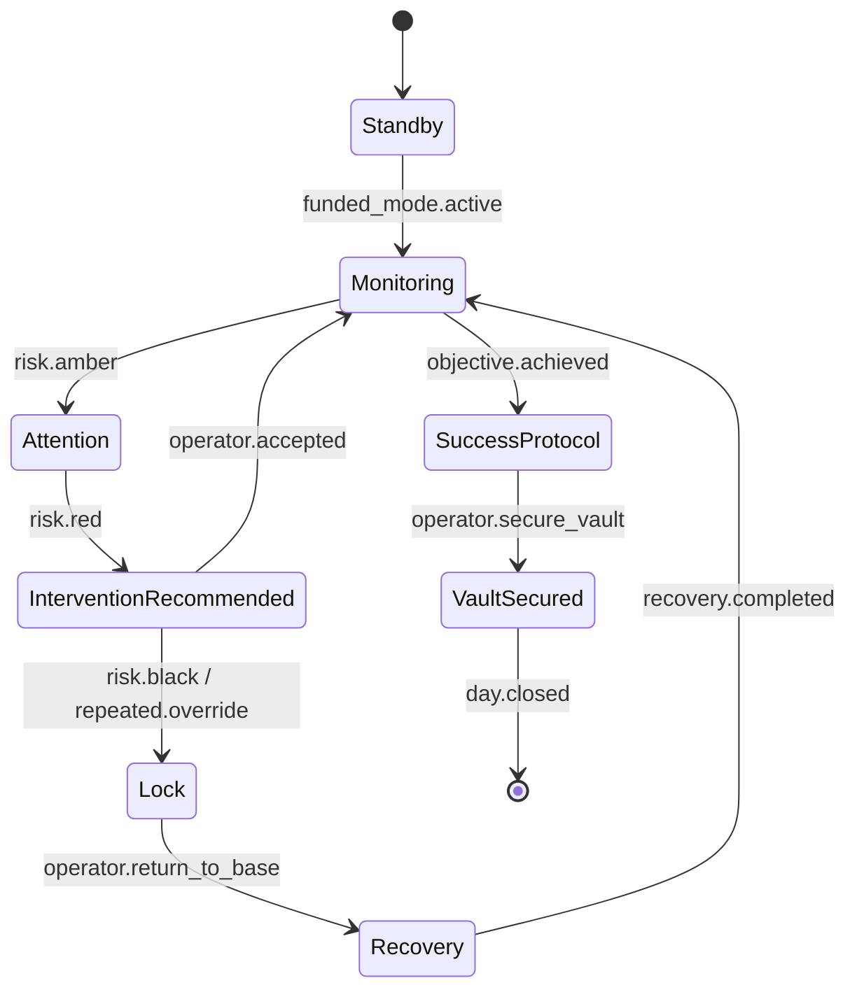

# Guardian State Machine Diagram

```mermaid
stateDiagram-v2
    [*] --> Standby
    Standby --> Monitoring: funded_mode.active
    Monitoring --> Attention: risk.amber
    Attention --> InterventionRecommended: risk.red
    InterventionRecommended --> Monitoring: operator.accepted
    InterventionRecommended --> Lock: risk.black / repeated.override
    Lock --> Recovery: operator.return_to_base
    Recovery --> Monitoring: recovery.completed
    Monitoring --> SuccessProtocol: objective.achieved
    SuccessProtocol --> VaultSecured: operator.secure_vault
    VaultSecured --> [*]: day.closed
```
