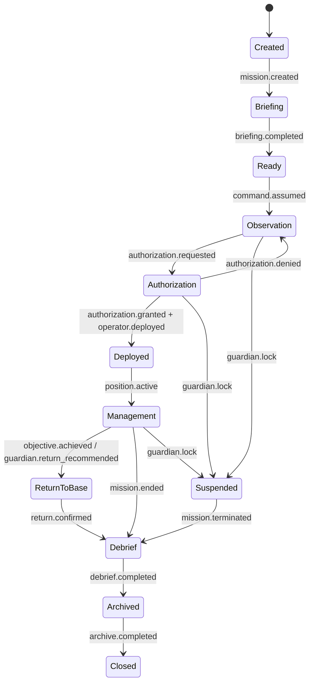

# Mission State Machine Diagram

```mermaid
stateDiagram-v2
    [*] --> Created
    Created --> Briefing: mission.created
    Briefing --> Ready: briefing.completed
    Ready --> Observation: command.assumed
    Observation --> Authorization: authorization.requested
    Authorization --> Observation: authorization.denied
    Authorization --> Deployed: authorization.granted + operator.deployed
    Deployed --> Management: position.active
    Management --> ReturnToBase: objective.achieved / guardian.return_recommended
    Management --> Debrief: mission.ended
    ReturnToBase --> Debrief: return.confirmed
    Debrief --> Archived: debrief.completed
    Archived --> Closed: archive.completed
    Observation --> Suspended: guardian.lock
    Authorization --> Suspended: guardian.lock
    Management --> Suspended: guardian.lock
    Suspended --> Debrief: mission.terminated
```
