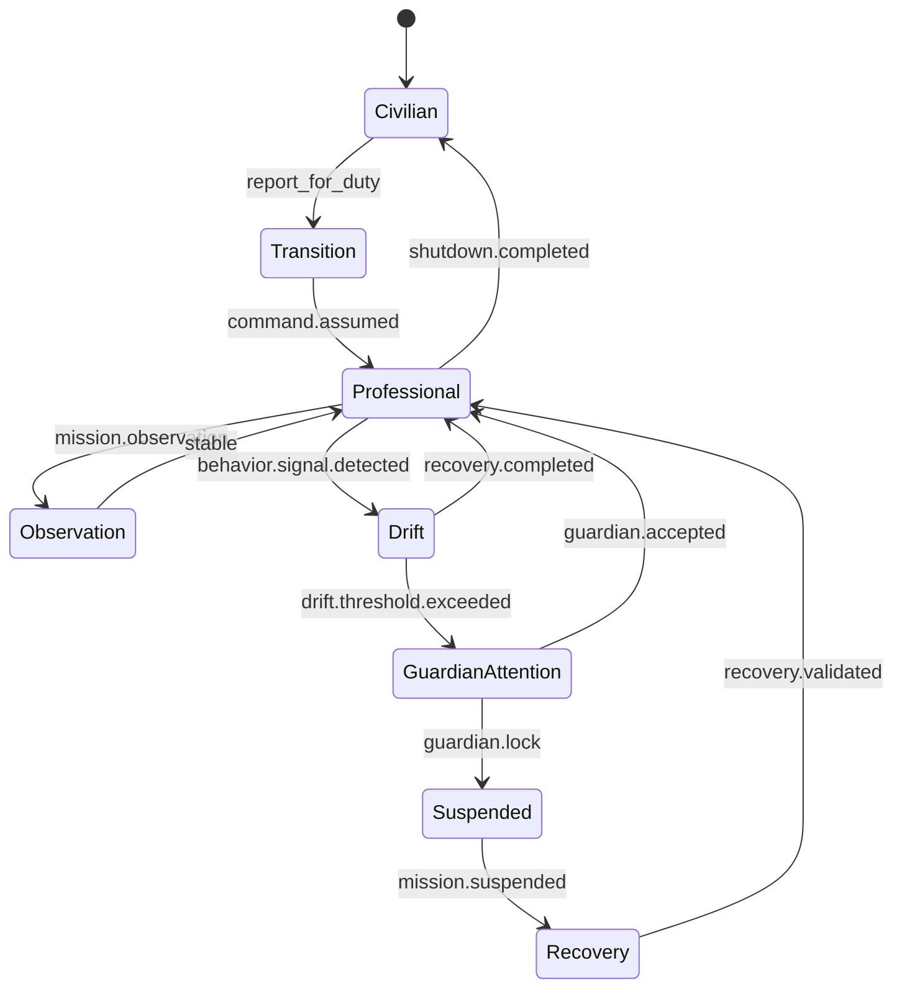

# Operator State Machine Diagram

```mermaid
stateDiagram-v2
    [*] --> Civilian
    Civilian --> Transition: report_for_duty
    Transition --> Professional: command.assumed
    Professional --> Observation: mission.observation
    Observation --> Professional: stable
    Professional --> Drift: behavior.signal.detected
    Drift --> Professional: recovery.completed
    Drift --> GuardianAttention: drift.threshold.exceeded
    GuardianAttention --> Professional: guardian.accepted
    GuardianAttention --> Suspended: guardian.lock
    Suspended --> Recovery: mission.suspended
    Recovery --> Professional: recovery.validated
    Professional --> Civilian: shutdown.completed
```
